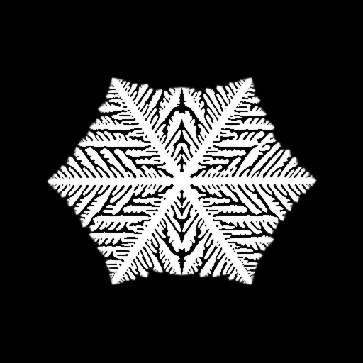
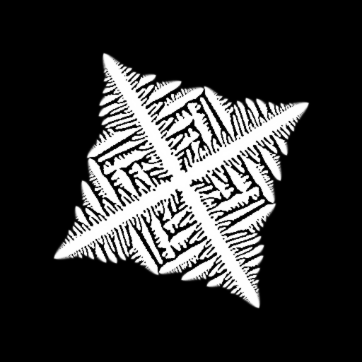
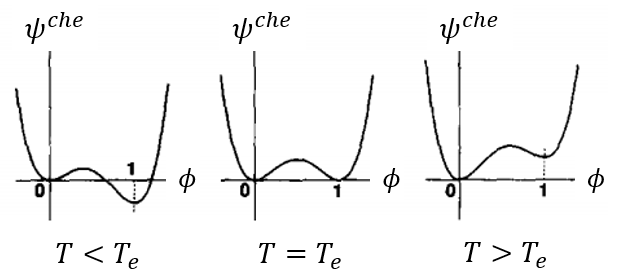

# Snowflake by Phase Field
## Crystalline growth of dendrite snow simulated by phase field with Taichi-based cross-platform parallel (CPU/**GPU**) computing

|  |  |
| :------------------------------------------------: | :-----------------------------------------------: |

|  |  |
| :------------------------------------------------------: |:----------------------------------------------------------: |

## Installation and Usage

1. install Python (3.8+) and pip, then install Taichi and numpy
> pip install numpy  
> pip install taichi  

2. git clone this repo
3. go to the current directory of this repo, run the code in command line by:
> python ./snow_dendrite.py  

then sub-window will show up the snowflake with dendrite morphology. 

## Model

### Phase Description

Phase field model is utilized to describe the snow dendrite. For snow:

+ Snow is solidified from water vapor.  Thus, two phases are involved, the solid phase and the gas phase.  

+ Phase field model is employed to describe phase transformation, with $\phi(\boldsymbol{x})=0$ representing gas phase, $\phi(\boldsymbol{x}) = 1$ representing solid phase, and $0 < \phi(\boldsymbol{x}) < 1$ at solid/gas interface. $\phi(\boldsymbol{x})$ also represents the volume fraction of solid phase at position $\boldsymbol{x}$.

Two aspects should be considered to generate the directional dendrite:

+ Anisotropic interface energy (comes from crystalline (atomic) structure of ice) results in a polyhedron shape of ice nucleation (certain facets of the polyhedron relate to the low-energy interface)
+ temperature field with heat conduction (vapor tends to solidify at cooler position, where the solidification itself will release heat) contributes to dendrite formation. The vertex of polyhedron is cooler than the facet of polyhedron (less solidification heat at the vertex) so that vertex tends to grow faster than other places, forming dendrite shape. 

These phenomena can be seen from the above animations generated by simulation from this repo. 

### Free energy

Free energy contains chemical energy and interface energy. 

The chemical energy determines the transition potential between vapor and ice. When temperature is high, ice tends to transform to vapor, indicating that vapor has lower potential than ice; otherwise then temperature is low, vapor tends to solidify to ice, indicating that ice has lower potential than vapor. Thus, the chemical energy density (here we use volume density, different from chemical potential defined by mole density) should be a function of temperature, which can be constructed as [[Physica D 63(3-4): 410-423](https://www.sciencedirect.com/science/article/abs/pii/016727899390120P)]:

$$\psi^{che} = \frac{1}{4}\phi^{4} - (\frac{1}{2} - \frac{1}{3}m(T))\phi^{3} +(\frac{1}{4} - \frac{1}{2}m(T))\phi^{2}$$

$$with\ \ m(T) = (\alpha/\pi)tan^{-1}[\gamma(T_{e} - T)]$$

where $T_{e}$ is the equilibrium temperature.  Such a chemical energy varies with temperature as shown in following Fig. 1, which generates tendency for solidification at low temperature $(T < T_{e})$ and generates tendency for vaporizing at high temperature $(T > T_{e})$. 

<em>Fig. 1 Chemical energy density varies with temperature </em>

You can also see that there is a energy barrier in Fig. 1 between gas and solid phase, so that the transition needs other kinds of energy to overcome this transition barrier, such as the interface energy. For example, vapor tends to solidify at the interface of a nucleus, since the nucleus's interface energy helps overcoming the transition barrier of solidification. 

Besides chemical energy, another energy is the gradient energy, expressed as:

$$\psi^{gra} = \frac{1}{2}\epsilon^{2}(\nabla\phi)^{2}$$

where $\epsilon$ is an anisotropic parameter which depends on the orientation of $\nabla\phi$ as

$\epsilon(\nabla\phi) = \overline{\epsilon}(1 + \delta cos[j(\theta - \theta_{0})])$,  where $\theta$ is the angle between interface normal and x-axis, expressed as $\theta(\nabla\phi) = \angle(\nabla\phi, \overrightarrow{x} )$ .

The total free energy $\Psi$ is a functional of $\phi(\boldsymbol{x})$, containing both the chemical energy and interface energy:

$$\Psi[\phi(\boldsymbol{x})] = \int \psi(\phi(\boldsymbol{x}), \nabla_{\boldsymbol{x}}\phi) d\Omega = \int (\psi^{che} +\psi^{gra})d\Omega$$

### Governing Equation (decline of free energy)

The governing equation for $\dot{\phi}(\boldsymbol{x})$ takes Ginzburg-Landau equation to ensure the decline of free energy, 

$$\dot{\phi}(\boldsymbol{x}) = -M\frac{\delta\Psi[\phi(\boldsymbol{x})]}{\delta\phi(\boldsymbol{x})} = M(-\frac{\partial\psi}{\partial\phi(\boldsymbol{x})}+\nabla\cdot\frac{\partial\psi}{\partial\nabla_{\boldsymbol{x}}\phi})$$

where the first term and second term of $-\frac{\partial\psi}{\partial\phi(\boldsymbol{x})}+\nabla\cdot\frac{\partial\psi}{\partial\nabla_{\boldsymbol{x}}\phi}$ can be interpreted as the driving forces from chemical energy and interface energy respectively. 

### Temperature field

The solidification will release heat, and the heat conduction will change the temperature distribution, and corresponding change the chemical energy density distribution (change the tendency of solidification or vaporization). The temperature rate can be expressed as:

$$\dot{T}(\boldsymbol{x}) = \nabla^{2}T + K \dot{\phi}(\boldsymbol{x})$$

where the first term relates to heat conduction, and the second term relates to heat source coming from phase transformation, which is also called the latent heat. Using the rates $\dot{\phi}(\boldsymbol{x})$ and  $\dot{T}(\boldsymbol{x})$, we can update the phase field and the temperature field for each time step $\Delta t$, where 4th-order Runge-Kutta (RK4) method is utilized for time integration. 

### Numerical scheme

+ Space discretization and partial differential operators utilize finite difference method (FDM).  

+ Time integration scheme utilizes 4th-order Runge-Kutta method (RK4).

## Reference

+ Phase field model of snow dendrite [Physica D 63(3-4): 410-423](https://www.sciencedirect.com/science/article/abs/pii/016727899390120P)
+ introduction of Taichi parallel computing language at github [https://github.com/taichi-dev/taichi](https://github.com/taichi-dev/taichi)
+ Taichi documentation [https://docs.taichi-lang.org/docs](https://docs.taichi-lang.org/docs)
